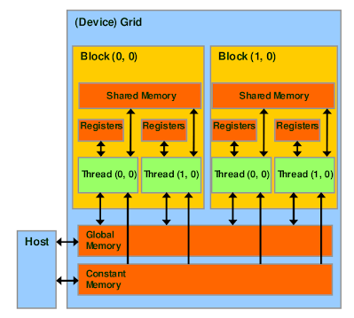

# CUDA

**C**ompute **U**nified **D**evice **A**rchitecture

refer to : https://developer.nvidia.com/blog/even-easier-introduction-cuda/

or https://docs.nvidia.com/cuda/cuda-c-programming-guide/index.html

## Compile & run

````bash
nvcc file.cu
./a.out
````

## Device code

````c++
__global__ void function(){
	
}
````

### Launch device code from host

````c++
function<<NBlocks, NThreads Per Block>>(int param);
````

Therefore given N elements we have:

NBlocks = arbitrary

NThreads = N / NBlocks

### Kernel variables

````c++
int index = threadIdx.x;
int stride = blockDim.x;
````


### Guidelines for Thread and Block numbers

- Block numbers should always be a multiple of 32.
- Look at hardware, decide from there
- Look up number of active blocks and active threads
- Blocks are distributed over the SM and the rest is put into a pipeline

[dimensions - CUDA determining threads per block, blocks per grid - Stack Overflow](https://stackoverflow.com/questions/4391162/cuda-determining-threads-per-block-blocks-per-grid)

## CPU / GPU data transfer

### Arrays

````c++
# Declare a pointer
int *data;
# Hand adress of pointer to function, pass data size
# Allocated unified memory, accesible from CPU and GPU
cudaMallocManaged(&data, N*sizeof(double));

# Or handle data transfer manually which in most cases is adwised
# host memory allocation
int * h_data = (int*)malloc(N*sizeof(int));
# Declare device data pointer
int * d_data;
# Use double pointer (!) to allocate device memory
cudaMalloc(&d_data, N*sizeof(int))
# <Initialize data on host here>
# Copy data from host to device
cudaMemcpy(d_data, h_data, N*sizeof(int), cudaMemcpyHostToDevice);
# <Do calculations here>
# Copy memory back from device to host
cudaMemcpy(h_data, d_data, N*sizeof(int), cudaMemcpyDeviceToHost);

# After finishing
cudaFree(data);
````

### Single values

````c++
int h_answer;
int* d_answer;

cudaMalloc(&d_answer, sizeof(int));

cudaMemcpy(&h_answer, d_answer, sizeof(int), cudaMemcpyHostToDevice); 

cudaMemcpy(&h_answer, d_answer, sizeof(int), cudaMemcpyDeviceToHost); 
````

c

## Shared memory, global memory and unified memory

### Unified memory

Can be accessed from the CPU and GPU. Is simpler to use with the cost of efficiency. Use ``cudaMallocManaged`` to initialize. 

### Global Memory

Is stored on the device, can be copied back from the device to the host. Access to global memory is generally faster when not random. ``CudaMalloc`` gives you global memory.

### Shared Memory

Only lives until a block of kernel finishes. Cannot be copied from host or back to host. Is around 10^3 faster than global memory. I used to avoid copying data from global memory multiple times. Can be initialized using ``__shared__ int var``. Only shareable among one block.

```c++
__shared__ int var;
// an array:
__shared__ int var[N];
// without memory allocation
extern __shared__ int var[];
```


### Private memory

There also exists the per thread private memory which is simply initialized by calling ``int var``

## The CUDA memory model



## Atomic operators

Can be used everywhere, where the memory is accessible. Guarantees race condition free arithmetic operations.

````c++
atomicAdd(float * adress, int value);
````

## Reductions

[CUDA Webinar 2 (nvidia.com)](https://developer.download.nvidia.com/assets/cuda/files/reduction.pdf)

## Debugging

Best practice, scale up parallelization slowly, use asserts inside kernel:

````c++
#include <assert.h>

__global__ void func(){
    assert(x > 0)
}
````


